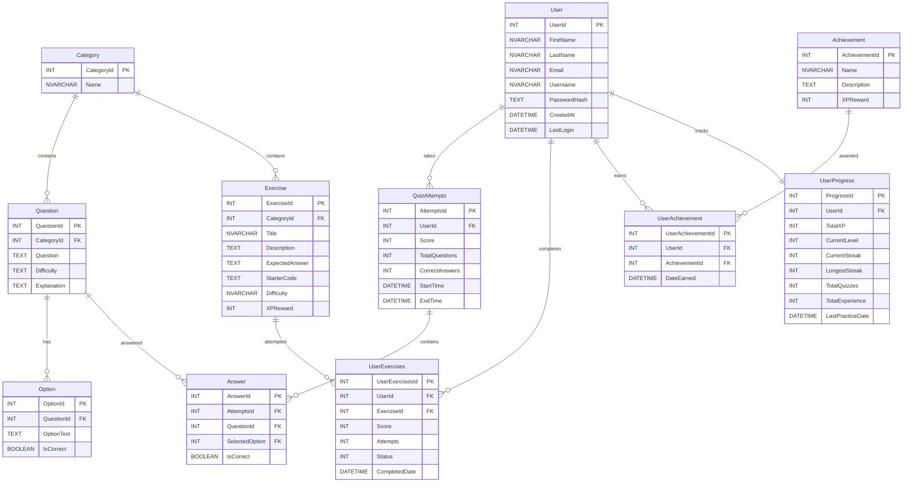

# StaySharp Entity Relationship Diagram

```mermaid
erDiagram

    User {
        INT UserId PK
        NVARCHAR FirstName
        NVARCHAR LastName
        NVARCHAR Email
        NVARCHAR Username
        TEXT PasswordHash
        DATETIME CreatedAt
        DATETIME LastLogin
    }

    Category {
        INT CategoryId PK
        NVARCHAR Name
    }

    Question {
        INT QuestionId PK
        INT CategoryId FK
        TEXT Question
        TEXT Difficulty
        TEXT Explanation
    }

    Option {
        INT OptionId PK
        INT QuestionId FK
        TEXT OptionText
        BOOLEAN IsCorrect
    }

    QuizAttempts {
        INT AttemptsId PK
        INT UserId FK
        INT Score
        INT TotalQuestions
        INT CorrectAnswers
        DATETIME StartTime
        DATETIME EndTime
    }

    Answer {
        INT AnswerId PK
        INT AttemptsId FK
        INT QuestionId FK
        INT SelectedOption FK
        BOOLEAN IsCorrect
    }

    Exercise {
        INT ExerciseId PK
        INT CategoryId FK
        NVARCHAR Title
        TEXT Description
        TEXT ExpectedAnswer
        TEXT StarterCode
        NVARCHAR Difficulty
        INT XPReward
    }

    UserExercises {
        INT UserExercisesId PK
        INT UserId FK
        INT ExerciseId FK
        INT Score
        INT Attempts
        INT Status
        DATETIME CompletedDate
    }

    Achievement {
        INT AchievementId PK
        NVARCHAR Name
        TEXT Description
        INT XPReward
    }

    UserAchievement {
        INT UserAchievementId PK
        INT UserId FK
        INT AchievementId FK
        DATETIME DateEarned
    }

    UserProgress {
        INT ProgressId PK
        INT UserId FK
        INT TotalXP
        INT CurrentLevel
        INT CurrentStreak
        INT LongestStreak
        INT TotalQuizzes
        INT TotalExperience
        DATETIME LastPracticeDate
    }

    User ||--o{ QuizAttempts : takes
    User ||--o{ UserExercises : completes
    User ||--o{ UserAchievement : earns
    User ||--|| UserProgress : tracks

    Category ||--o{ Question : contains
    Category ||--o{ Exercise : contains

    Question ||--o{ Option : has
    Question ||--o{ Answer : answered

    QuizAttempts ||--o{ Answer : contains

    Exercise ||--o{ UserExercises : attempted

    Achievement ||--o{ UserAchievement : awarded
```
